# Data Storage

## Bits and their storage

### Bits and Bit Patterns

Inside today’s computers all information is encoded as patterns of 0s and 1s called **bits** (short for binary digits).
Bit Patterns are used to represent information.

### Gates and Flip-flops

A device that produces the output of a Boolean operation when given the
operation’s input values is called a **gate**, or sometimes a **logic gate**.
- **A logic gate is a hardware abstraction that is modeled by a Boolean function.**

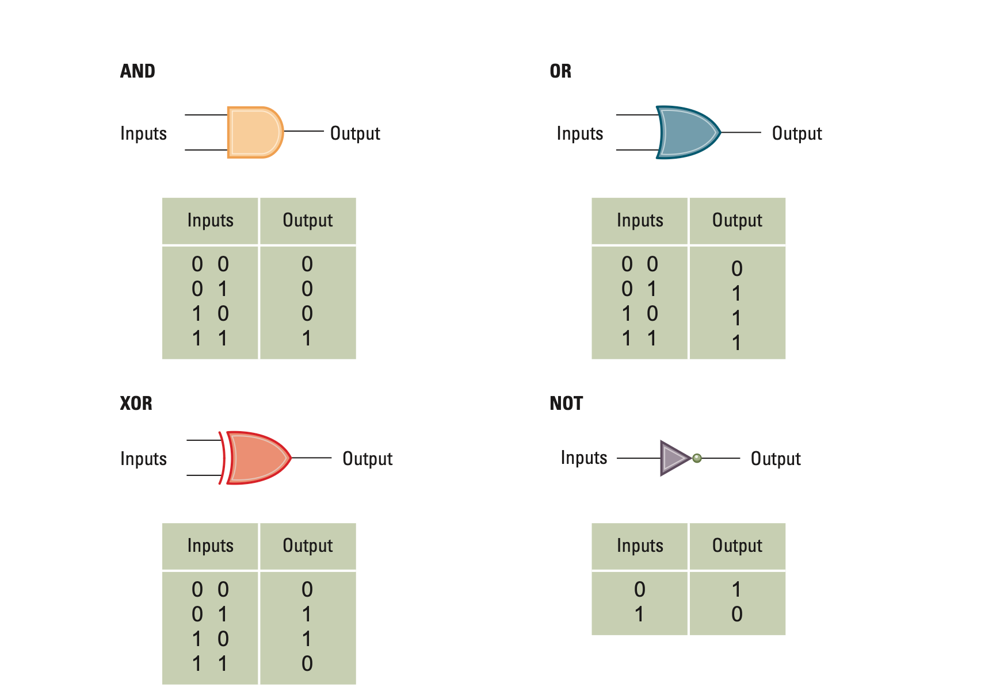

**Flip-Flop Circuit**

A flip-flop is a fundamental
unit of computer memory. It is a circuit that produces an output value
of 0 or 1, which remains constant until a pulse (a temporary change to
a 1 that returns to 0) from another circuit causes it to shift to the other
value.

- **In other words, the output can be set to “remember” a zero or a one
under control of external stimuli.**

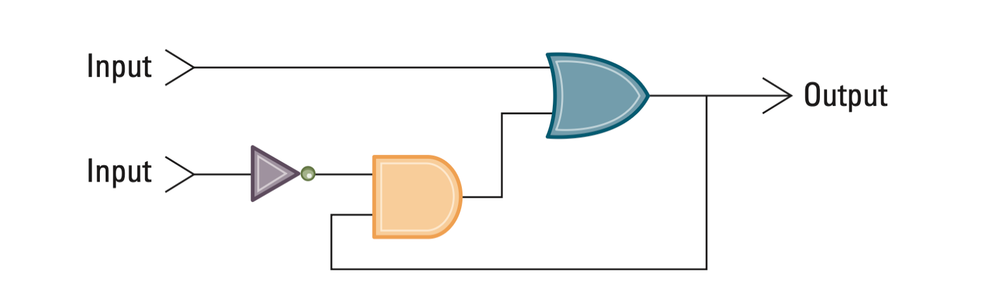

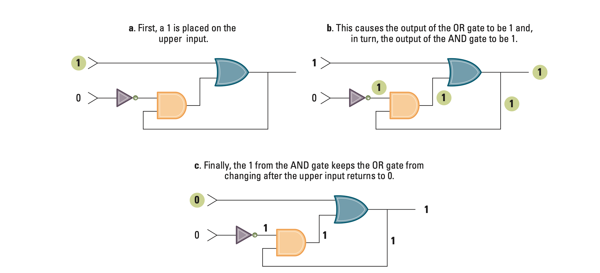

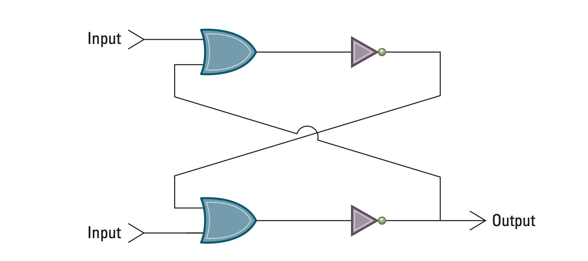

    Essential knowledge
    - Binary data is processed by physical layers of computing hardware, including gates, chips, and components.
    - Hardware is built using multiple levels of abstractions, such as transistors, logic gates, chips, memory, motherboards, special purposes cards, and storage devices.

### Hexadecimal notation

A long string of bits is often called a **stream**

To simplify the representation of long bit patterns we use a
shorthand notation called **hexadecimal notation**

- bit patterns within a machine tend to have lengths in multiples of four
- hexadecimal notation uses a single symbol to represent a pattern of four bits
- math subscripts to indicate the base of a non-decimal number
    - the hexadecimal value for $15_{10}$ is $F_{16}$
- the common prefix “0x” in front of our
hexadecimal numbers

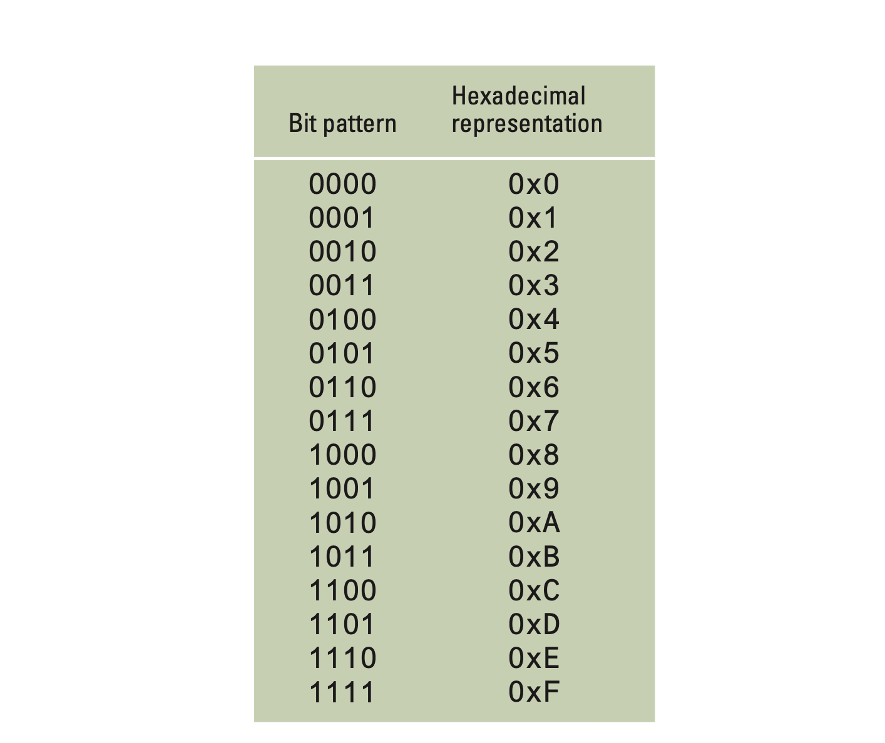

## Main Memory

For the purpose of storing data, a computer contains a large collection of circuits (such as flip-flops), each capable of storing a single bit. This bit reservoir is known as the machine’s main memory.

- A computer’s main memory is organized in manageable units called **cells**
- a typical cell size being eight bits
- A string of eight bits is called a byte

Although there is no left or right within a computer, we normally envision the bits within a memory cell as being arranged in a row. The left end of this row is called the **high-order end**, and the right end is called the **low-order end**. The leftmost bit is called either the high-order bit or the **most significant bit** in reference to the fact that if the contents of the cell were interpreted as representing a numeric value, this bit would be the most significant digit in the number. Similarly, the rightmost bit is referred to as the **low-order bit** or the **least significant bit**.


- To identify individual cells in a computer’s main memory, each cell is assigned a unique “name,” called its **address**.
- Such an addressing system not only gives us a way of uniquely identifying each cell but also associates an order to the cells such as "the next cell" or "the previous cell."
- Assigning an order to both the cells in main memory and the bits within each cell makes the entire collection of bits within a computer’s main memory is essentially ordered in one long row
- Pieces of
this long row can therefore be used to store bit patterns that may be longer
than the length of a single cell
    - store a string of 16
bits merely by using two consecutive memory cells


Because a computer’s main memory is organized as individual, addressable cells, the cells can be accessed independently as required. To reflect the ability to access cells in any order, a computer’s main memory is often called **random access memory (RAM)**

### Measuring Memory Capacity

It is convenient to design main memory systems in which the total number of cells is a power of two.

| Unit | Symbol | Equivalent |
|---|---:|---:|
| Bit | bit (b) | 0 or 1 |
| Byte | B | 8 bits |
| Kibibyte | KiB | 1,024 B = 2¹⁰ B |
| Mebibyte | MiB | 1,024 KiB = 2²⁰ B |
| Gibibyte | GiB | 1,024 MiB = 2³⁰ B |
| Tebibyte | TiB | 1,024 GiB = 2⁴⁰ B |

**Important:** KB, MB, GB technically refer to decimal units (1,000), while KiB, MiB, GiB are binary units (1,024). For computer memory, the binary units are often what you want.

## Mass Storage

Due to the volatility and limited size of a computer’s main memory, most
computers have additional memory devices called mass storage (or secondary storage) systems.

- magnetic disks
- CDs, DVDs
- magnetic tapes
- flash drives and solid-state drives

### Magnetic Systems

The most common example in use today is the magnetic disk or hard disk drive (HDD), in which a thin, spinning disk with magnetic coating is used to hold data.

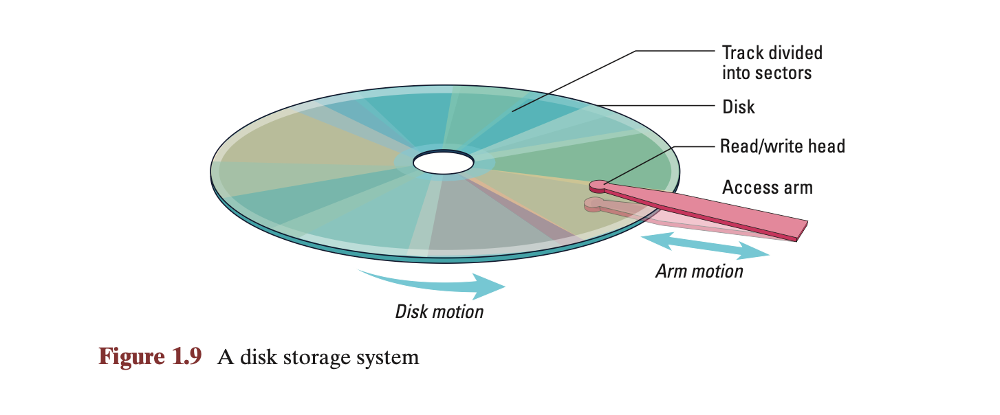

    Essential knowledge
    - The bandwidth of a system is a measure of bit rate—the amount of data (measured in bits) that can be sent in a fixed amount of time.
    - The latency of a system is the time elapsed between the transmission and the receipt of a request.

### Optical Systems

Another class of mass storage systems applies optical technology.

- **Compact Disk (CD)**
    - These disks are 12 centimeters (approximately 5 inches) in diameter and consist of reflective material covered with a clear protective coating.
    - Information is recorded on them by creating variations in their reflective surfaces.
    - This information can then be retrieved by means of a laser that detects irregularities on the reflective surface of the CD as it spins.
    - Traditional CDs have capacities in the range of 600 to 700MB

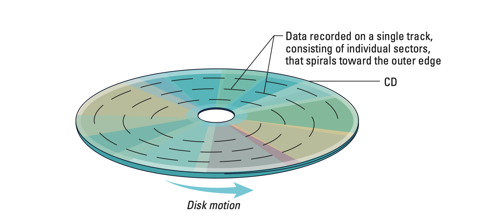

- **DVDs (Digital Versatile Disks)**
    - are constructed from multiple, semi-transparent layers that serve as distinct surfaces when viewed by a precisely focused laser
    - provide storage capacities of several GB

- **BDs (Blu-ray Disks)**
    - Uses Blu-ray technology, which uses a laser in the blue-violet spectrum of light (instead of red), is able to focus its laser beam with very fine precision.
    - provide over five times the capacity of a DVD

### Flash Drives

Mass storage systems based on magnetic or optic technology uses physical motion such as spinning disks, moving read/write heads, and aiming laser beams to store and retrieve data.
Data storage and retrieval is slow compared to the speed of electronic circuitry

**Flash Memory Technology**

In a flash memory system, bits are stored by sending electronic signals directly to the storage medium where they cause electrons to be trapped in tiny chambers of silicon dioxide, thus altering the characteristics of small electronic circuits.

Although data stored in flash memory systems can be accessed in small, byte-size units as in RAM applications, current technology dictates that stored data be erased in large blocks.

- repeated erasing slowly damages the silicon dioxide chambers
- current flash memory technology is not suitable for general main memory applications where its contents might be altered many times a second.

**Devices:**

Flash memory devices called ***flash drives***, with capacities of hundreds of GBs, are available for general mass storage applications

Larger flash memory devices called **SSDs (solid-state drives)** are explicitly designed to take the place of magnetic hard disks.

- SSD sectors suffer from the more limited lifetime of all flash memory technologies, but the use of wear-leveling techniques can reduce the impact of this by relocating frequently altered data blocks to fresh locations on the drive.

Another application of flash technology is found in **SD (Secure Digital)memory cards** (or just SD cards).

- These provide up to two GBs of storage and are packaged in a plastic-rigged wafer about the size of a postage stamp. (SD cards are also available in smaller mini and micro sizes.)

**SDHC (High Capacity) memory cards** can provide up to 32 GBs and the next generation **SDXC (Extended Capacity) memory cards** can exceed a TB

## Representing Information as Bit Patterns

### Representing Text

Information in the form of text is normally represented by means of a code in which each of the different symbols in the text (such as the letters of the alphabet and punctuation marks) is assigned a unique bit pattern. The text is then represented as a long string of bits in which the successive patterns represent the successive symbols in the original text.

**ASCII** (American Standard Code for Information Interchange)
- uses bit patterns of length seven
- extended to an eight-bit-per-symbol format by adding a 0 at the most significant end of each of the seven-bit patterns

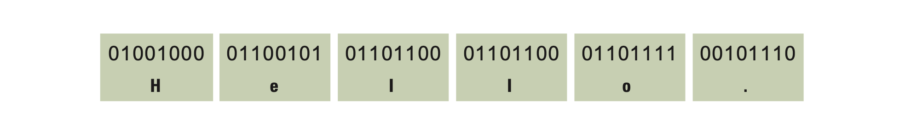

**Unicode**
- uses a unique pattern of up to 21 bits to represent each symbol

**Unicode Transformation Format 8-bit (UTF-8)**

When the **Unicode character set** is combined with the **Unicode Transformation Format 8-bit (UTF-8)** encoding standard:

- original ASCII characters can still be represented with 8 bits
- while the thousands of additional characters from other languages can be represented by 16 bits.
- UTF-8 uses 24- or 32-bit patterns to represent more obscure Unicode symbols, leaving ample room for future expansion

A file consisting of a long sequence of symbols encoded using ASCII or Unicode is often called a **text file**

### Representing Numeric Values

Storing information in terms of encoded characters is inefficient when the information being recorded is purely numeric.

By using binary notation, we can store any integer in the range from 0 to 65535 in 16 bits for example.

**Common forms of binary notation**

- two's complement notation is common for storing whole numbers (both positive and negative values)
- floating-point notation for representing numbers with fractional parts

### Representing Images

One means of representing an image is to interpret the image as a collection of dots, each of which is called a **pixel**, short for "picture element."

The appearance of each pixel is then encoded and the entire image is represented as a collection of these encoded pixels. Such a collection is called a **bit map**.

### Representing Sound

The most generic method of encoding audio information for computer storage and manipulation is to sample the amplitude of the sound wave at regular intervals and record the series of values obtained.

## The Binary System

### Binary Notation

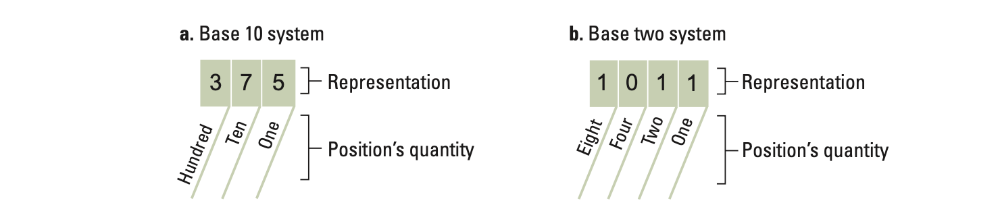

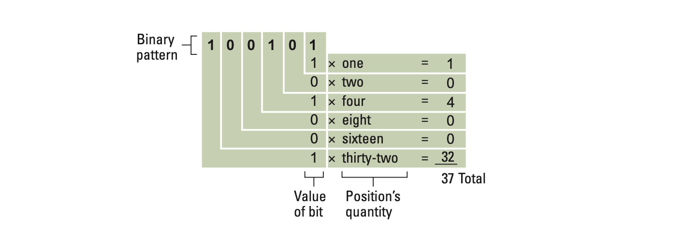

**An algorithm for finding the binary representation of a positive integer**

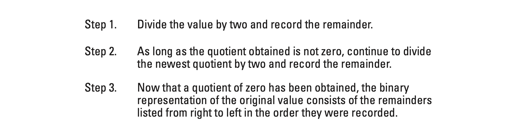

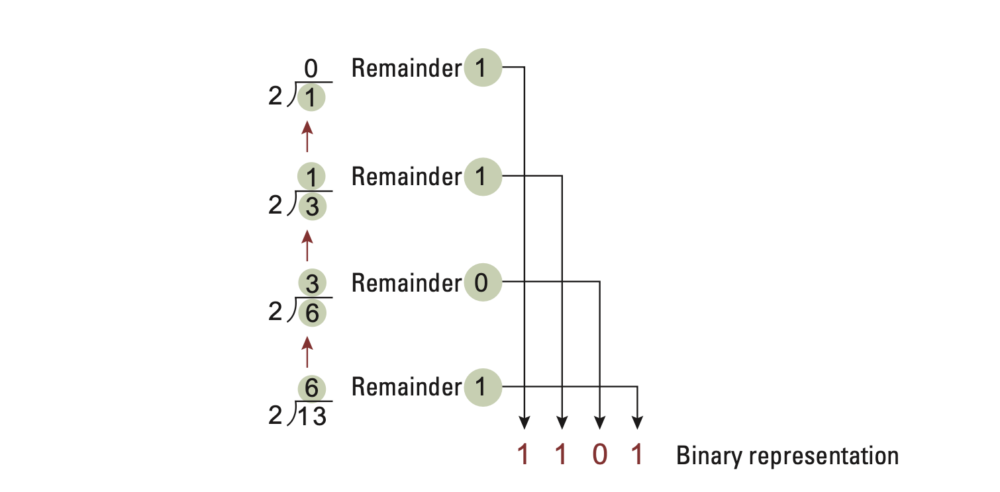

### Binary Addition

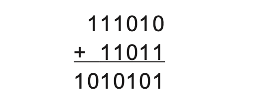

### Fractions in Binary

To extend binary notation to accommodate fractional values, we use a radix point in the same role as the decimal point in decimal notation.

- digits to the left of the point represent the integer part (whole part)
- digits to the right represent the fractional part of the value
    - their positions are assigned fractional quantities

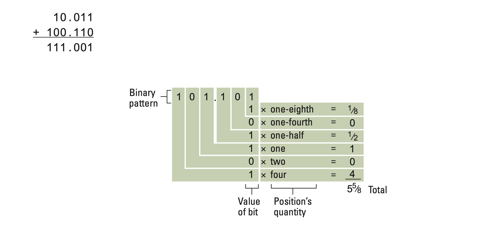

## Storing Integers

### Two's Complement Notation

- Uses a fixed number of bits to represent each of the values in the system
- **sign bit** - the leftmost bit of a bit pattern indicates the sign of the value represented

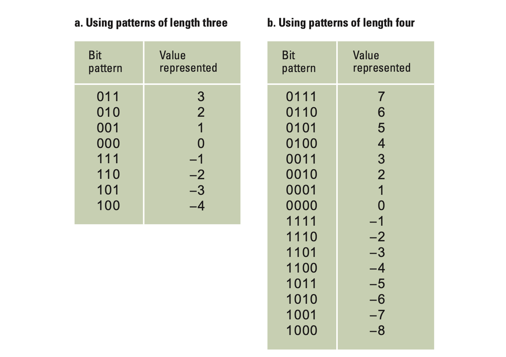

There is a convenient relationship between positive and negative values of the same magnitude

- They are identical when read from right to left, up to and including the first 1
- From there on, the patterns are complements of one another
    - The complement of a pattern is the pattern obtained by reversing the values: 0 -> 1, 1 -> 0

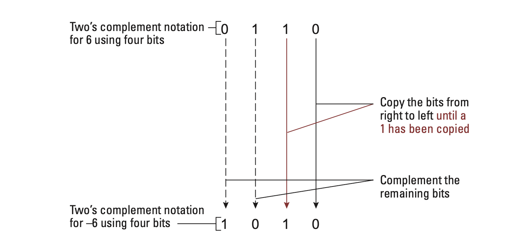

### Addition in Two's Complement Notation

We apply the same algorithm that we used for binary addition, except that all bit patterns, including the answer, are the same length, any extra bit generated on the left of the answer by a final carry must be truncated

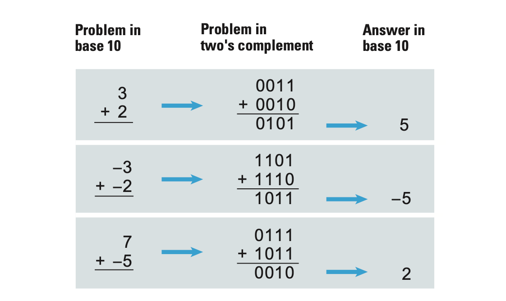

A major benefit of two’s complement notation:

- 7 - 5 can be written as 7 + (-5)
- a machine using two’s complement notation needs to know only how to add
- a circuit for addition combined with a circuit for negating a
value is sufficient for solving both addition and subtraction problems

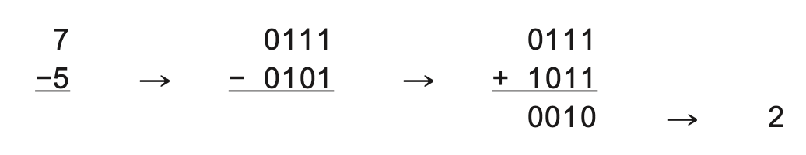

### The Problem of Overflow

When using two’s complement with patterns of 4 bits, the largest positive integer that can be represented is 7, and the most negative integer is -8.
In particular, the value 9 can not be represented, which means that we cannot hope to obtain the correct answer to the problem 5 + 4.
In fact, the result would appear as - 7 . This phenomenon is called **overflow**.

Today, it is common to use patterns of 32 bits for storing values in two’s complement notation, allowing for positive values as large as 2,147,483,647 to accumulate before overflow occurs.

## Excess Notation

Another method of representing integer values is **excess notation**

- each of the values in an excess notation system is represented by a bit pattern of the same length

**To establish an excess system:**

1. We first select the pattern length to be used
2. Then write down all the different bit patterns of that length in the order they would appear if we were counting in binary
3. We observe that the first pattern with a 1 as its most significant bit appears approximately halfway through the list
4. We pick this pattern to represent zero
5. The patterns following this are used to represent positive integers.
6. The patterns preceding it are used for negative integers

**Note** that one difference between an excess system and a two’s complement system is that the sign bits are reversed.

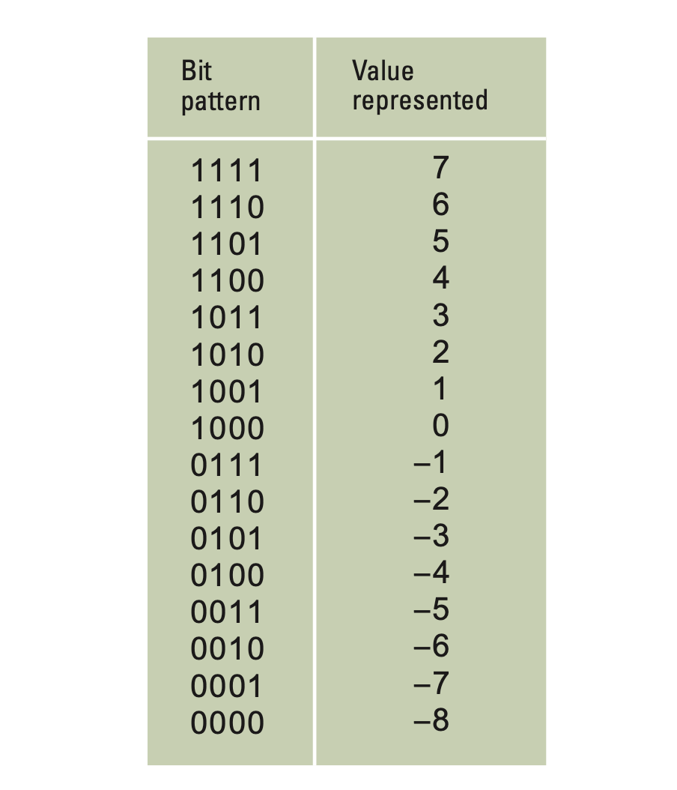

## Storing Fractions

### Floating-Point Notation

Stores not only the pattern of 0s and 1s representing its binary representation but also the position of the radix point

**Using 8 bits**

1. We first designate the high-order bit of the byte as the sign bit - 0 means nonnegative
2. We divide the remaining 7 bits of the byte into two groups
    - the exponent field
    - the mantissa field
3. Designate the 3 bits following the sign bit as the exponent field and the remaining 4 bits as the mantissa field

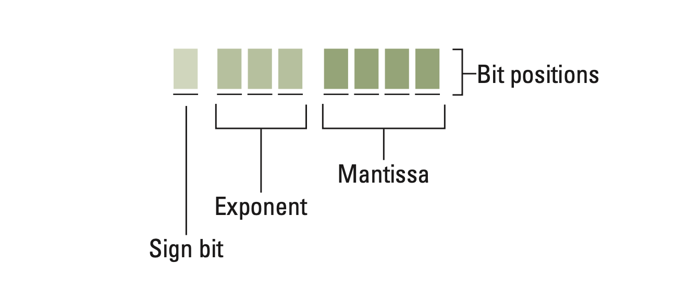

**To decode the byte**

Suppose a byte consists of the bit pattern 01101011

1. We first extract the mantissa and place a radix point on its left side, obtaining: **.1011**
2. Extract the contents of the exponent field (110) and interpret it as an integer stored using the 3-bit excess method
    - Thus, the pattern in the exponent field in our example represents a positive 2
    - This tells us to move the radix in our solution to the right by 2 bits
    - A negative exponent would mean to move the radix to the left
3. **We obtain 10.11** which is the binary representation for 2.75

**To store a value using floating-point notation, we reverse the preceding process**

To encode 1.125 -> (1 + 1/8):

1. We express it in binary notation and obtain 1.001
2. We copy the bit pattern into the mantissa field from left to right, **starting with the leftmost 1** in the binary representation
    - At this point, the byte looks like this: ____1001
3. Fill in the exponent field
    1. we imagine the contents of the mantissa field with a radix point at its left
    2. determine the number of bits and the direction the radix must be moved to obtain the original binary number
    3. write that number in excess notation (3bits) -> 101
4. We fill the sign bit with 0 because the value being stored is nonnegative -> 0.101.1001

**IMPORTANT**

The rule is to copy the bit pattern appearing in the binary representation from left to right, starting with the leftmost 1.
To clarify, consider the process of storing the value 3/8, which is .011 in binary notation.
In this case, the mantissa will be:

____1100

NOT ____0110

Representations that conform to this rule are said to be in normalized form.

Many of today’s computers support a 32 bit form of this notation called **Single Precision Floating Point**. This format uses 1 bit for the sign, 8 bits for the exponent (in an excess notation), and 23 bits for the mantissa.
Another form, called **Double Precision Floating Point**, uses 64 bits and provides a precision of 15 decimal digits.

### Truncation Errors

**Truncation error**, or **round-off error** — part of the value being stored is lost because the mantissa field is not large enough.

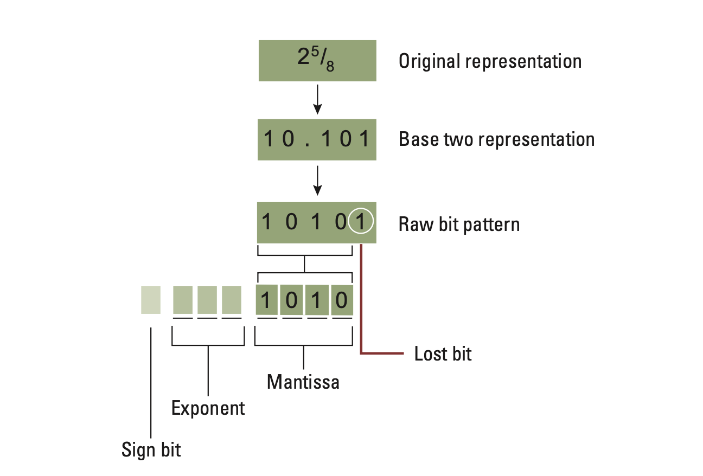

## Data Compression

**data compression** - to reduce the size of the data involved while retaining the underlying information

### Generic Data Compression Techniques

Data compression schemes fall into two categories:
1. **lossless** schemes - do not lose information in the compression process
2. **lossy** schemes - may lead to the loss of information but often provide more compression than lossless ones
    - popular in settings in which minor errors can be tolerated, as in the case of images and audio

**1. run-length encoding**

- popular where the data being compressed consist of long sequences of the same value
- lossless
- replaces sequences of identical data elements with a code, indicating the element that is repeated and the number of times it occurs in the sequence

**2. frequency-dependent encoding**

- lossless
- a system in which the length of the bit pattern used to represent a data item is inversely related to the frequency of the item’s use
    - **The more often something appears, the fewer bits we use to represent it.**

**3. relative encoding, aka differential encoding**

In some cases, the stream of data to be compressed consists of units, each of which differs only slightly from the preceding one.

For example consecutive frames of a motion picture.

- record the differences between consecutive data units rather than entire units
- each unit is encoded in terms of its relationship to the previous unit
- can be implemented in either lossless or lossy form

**dictionary encoding**

The term dictionary refers to a collection of building blocks from which the message being compressed is constructed.

The message itself is encoded as a sequence of references to the dictionary.

### Compressing Images

**1. GIF (Graphic Interchange Format)**

- is a dictionary encoding system
- approaches the compression problem by reducing the number of colors that can be assigned to a pixel to only 256
- The red-green-blue combination for each of these colors is encoded using three bytes
- these 256 encodings are stored in a table (a dictionary) called the **palette**
- Each pixel in an image can then be represented by a single byte whose value indicates which of the 256 palette entries represents the pixel’s color
- is a lossy compression system when applied to arbitrary images because the colors in the palette may not be identical to the colors in the original image

**2. JPEG**

Developed by the **Joint Photographic Experts Group**

- encompasses several methods of image compression, each with its own goals
- provides a lossless mode however does not produce high levels of compression when compared to other JPEG options -> rarely used
- **JPEG baseline standard** has become the standard of choice in many applications

JPEG baseline standard:

- requires a sequence of steps, some of which are designed to take advantage of a human eye’s limitations

### Compressing Audio and Video

The most commonly used standards for encoding and compressing audio and video were developed by the **Motion Picture Experts Group (MPEG)** -> these standards themselves are called MPEG

MPEG encompasses a variety of standards for different applications

**1. Video Compression**

- in general, video compression techniques are based on video being constructed as a sequence of pictures in much the same way that motion pictures are recorded on film
- To compress such sequences, only some of the pictures, called I-frames, are encoded in their entirety
- The pictures between the I-frames are encoded using relative encoding techniques

That is, rather than encode the entire picture, only its distinctions from the prior image are recorded. The I-frames themselves are usually compressed with techniques similar to JPEG

**2. Audio Compression**

The best known system for compressing audio is **MP3**

The acronym MP3 is short for **MPEG layer 3**

Takes advantage of the properties of the human ear, removing those details that the human ear cannot perceive

- **temporal masking** - for a short period after a loud sound, the human ear cannot detect softer sounds that would otherwise be audible
- **frequency masking** - a sound at one frequency tends to mask softer sounds at nearby frequencies

Using MPEG and MP3 compression techniques, video cameras are able to record as much as an hour’s worth of video within 128MB of storage, and portable music players can store as many as 400 popular songs in a single GB

In contrast to the goals of compression in other settings, the goal of compressing audio and video is not necessarily to save storage space. Just as important is the goal of obtaining encodings that **allow information to be transmitted over today’s communication systems fast enough** to provide timely presentation.

**Audio and video compression systems are often judged by the transmission speeds required for timely data communication**

- speeds are normally measured in **bits per second (bps)**

| Unit | Name | Bits per second |
|---|---|---:|
| Kbps | Kilobits per second | 1,000 bps |
| Mbps | Megabits per second | 1,000,000 bps |
| Gbps | Gigabits per second | 1,000,000,000 bps |

## Communication Errors

When information is transferred back and forth among different devices a chance exists that the bit pattern ultimately retrieved may not be identical to the original one.

To resolve such problems, a variety of encoding techniques have been developed to allow the detection and even the correction of errors.

Today, these techniques are largely built into the internal components of a computer system.

### Parity Bits

A simple method of detecting errors is based on the principle that if each bit pattern being manipulated has an odd number of 1s and a pattern with an even number of 1s is encountered, an error must have occurred.

**an encoding system in which each pattern contains an odd number of 1s**

- adding an additional bit, called a **parity bit**, to each pattern in an encoding system already available
- we assign the value 1 or 0 to this new bit so that the entire resulting pattern has an odd number of 1s
- -> a pattern with an even number of 1s indicates that an error has occurred and that the pattern being manipulated is incorrect

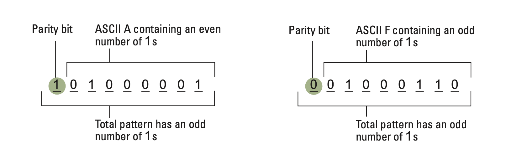

The parity system just described is called **odd parity**

Another technique is called **even parity** -> each pattern is designed to contain an even number of 1s

Today it is not unusual to find parity bits being used in a computer's main memory.
Although we envision these machines as having memory cells of 8-bit capacity, in reality, each has a capacity of 9 bits.

**Limitations**

If a pattern originally has an odd number of 1s and suffers two errors, it will still have an odd number of 1s

One means of minimizing this problem is sometimes applied to long bit patterns, such as the string of bits recorded in a sector on a magnetic disk. In this case, the pattern is accompanied by a collection of parity bits making up a **checkbyte**.

- Each bit within the checkbyte is a parity bit associated with a particular collection of bits scattered throughout the pattern
- one parity bit may be associated with every eighth bit in the pattern starting with the first bit
- while another may be associated with every eighth bit starting with the second bit

In this manner, a collection of errors concentrated in one area of the original pattern is more likely to be detected, since it will be in the scope of several parity bits.

Variations of this checkbyte concept lead to error
detection schemes known as **checksums** and **cyclic redundancy checks (CRC)**

### Error-Correcting Codes

**Hamming distance** - The Hamming distance between two bit patterns is the number of bits in which the patterns differ

The Hamming distance between the patterns representing A and B in the code is four, and the Hamming distance between B and C is three.

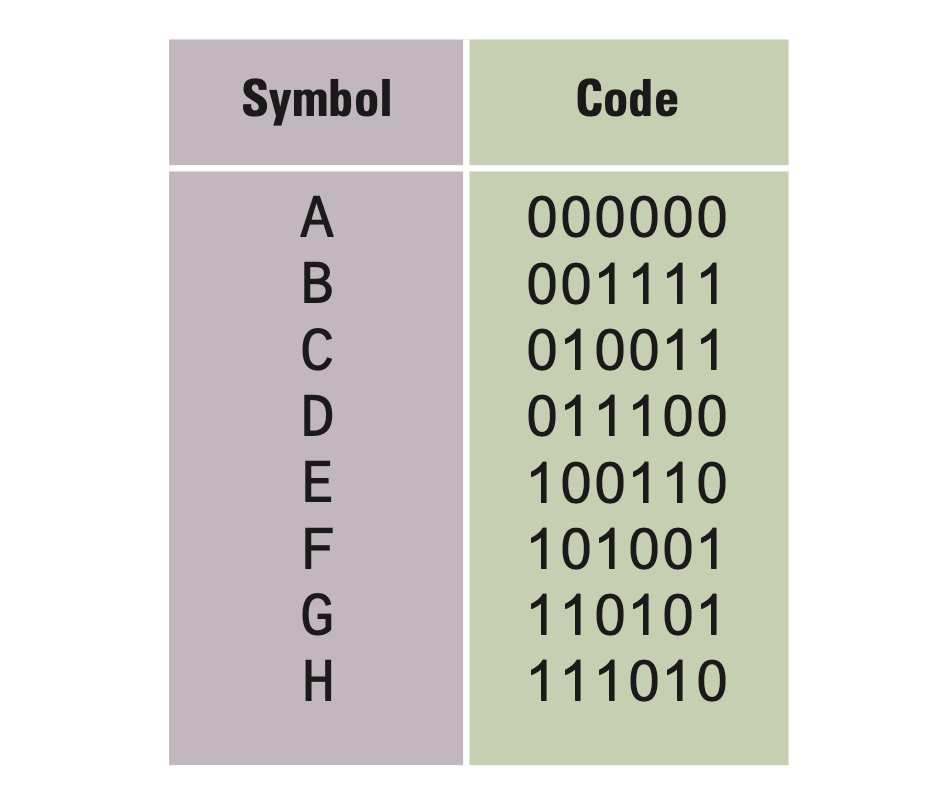

**In the code above**:

- The important feature of the code above is that any two patterns are separated by a Hamming distance of at least three.
- If a single bit is modified in a pattern, the error can be detected since the result will not be a legal pattern.
    - We must change at least 3 bits in any pattern before it will look like another legal pattern
    - We can also figure out what the original pattern was.
    - The modified pattern will be a Hamming distance of only one from its original form but at least two from any of the other legal patterns.

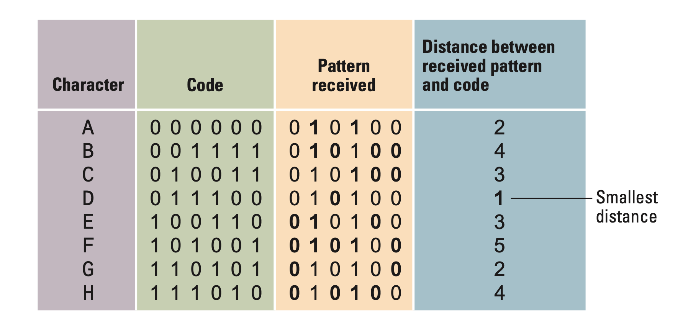

Using this technique allows us to detect up to two errors per pattern and to correct one error.

If we designed the code so that each pattern was a Hamming distance of at least five from each of the others, we would be able to detect up to four errors per pattern and correct up to two.

Error-correcting techniques are used extensively to increase the reliability of computing equipment:

- high-capacity magnetic disk drives
- CDs

# Data Manipulation

## Computer Architecture

The circuitry in a computer that controls the manipulation of data is called the **central processing unit**, or **CPU**.

The CPUs found in today’s desktop computers and notebooks are packaged as small flat squares that would fit in the palm of one’s hand and whose **connecting pins** plug into a socket mounted on the machine’s **main circuit board** (called the **motherboard**). In smartphones, tablets, and other mobile computing devices, CPU’s are around half the size of a postage stamp. Due to their small size, these processors are called **microprocessors**.

### CPU Basics

A CPU consists of three parts:

the **arithmetic/logic unit**

- contains the circuitry that performs operations on data (such as addition and subtraction)

the **control unit**

- contains the circuitry for coordinating the machine’s activities

the **register unit**

- contains data storage cells (similar to main memory cells), called **registers**, that are used for temporary storage of information within the CPU

- Some of the registers within the register unit are considered **general-purpose registers** whereas others are **special-purpose registers**

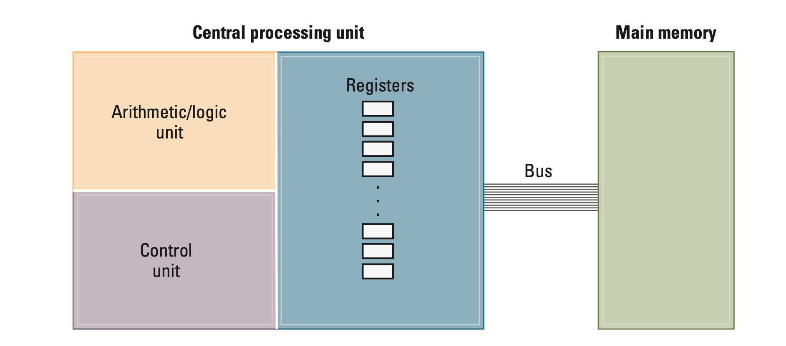

**General-purpose registers**

- serve as temporary holding places for data being manipulated by the CPU
- hold the inputs to the arithmetic/logic unit’s circuitry and provide storage space for results produced by that unit

**To perform an operation on data stored in main memory**

- the control unit transfers the data from memory into the general-purpose registers
- informs the arithmetic/logic unit which registers hold the data
- activates the appropriate circuitry within the arithmetic/logic unit, and tells the arithmetic/logic unit which register should receive the result.

For the purpose of transferring bit patterns, a machine’s CPU and main memory are connected by a collection of wires or traces called a **bus**

**Through this bus**

- the CPU extracts (reads) data from main memory by supplying the address of the pertinent/relevant memory cell along with an electronic signal telling the memory circuitry that it is supposed to retrieve the data in the indicated cell

- the CPU places (writes) data in memory by providing the address of the destination cell and the data to be stored together with the appropriate electronic signal telling main memory that it is supposed to store the data being sent to it

Based on this design, the task of adding two values stored in main memory involves more than the mere execution of the addition operation.

- The data must be transferred from main memory to registers within the CPU
- the values must be added with the result being placed in a register
- and the result must then be stored in a memory cell.

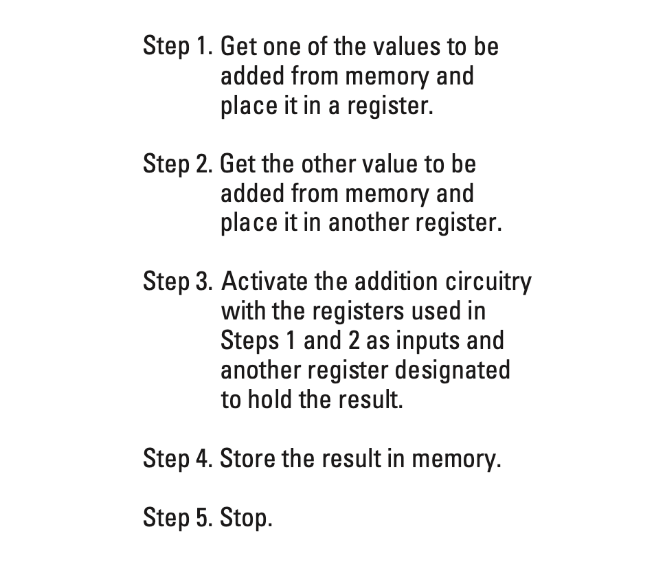

### The Stored-Program Concept

A program, just like data, can be encoded as a sequence of bits and stored in main memory.

If the control unit is designed to extract the program from memory, decode the instructions, and execute them, then the program that the machine follows can be changed merely by changing the contents of the computer’s memory instead of rewiring the CPU

    Essential Knowledge Statements

    A sequence of bits may represent instructions or data.

The idea of storing a computer’s program in its main memory is called the **stored-program concept**

Originally everyone thought of programs and data as different entities:

- Data were stored in memory; programs were part of the CPU

In early computers, the steps that each device executed were built into the control unit as a part of the machine.

- early electronic computers were designed so that the CPU could be conveniently rewired
- the program that the machine followed could be changed by rewiring the CPU

```
Cache Memory

It is instructive to compare the memory facilities within a computer in relation to their functionality.

- Registers are used to hold the data immediately applicable to the operation at hand
- main memory is used to hold data that will be needed in the near future
- mass storage is used to hold data that will likely not be needed in the immediate future

Many machines are designed with an additional memory level, called cache memory.
Cache memory is a portion (perhaps several hundred KB) of high-speed memory located within the CPU itself.

In this special memory area, the machine attempts to keep a copy of that portion of main memory that is of current interest. In this setting, data transfers that normally would be made between registers and main memory are made between registers and cache memory.

Any changes made to cache memory are then transferred collectively to main memory at a more opportune time.
The result is a CPU that can execute its machine cycle more rapidly because it is not delayed by main memory communication.
```

## Machine Language

To apply the stored-program concept, CPUs are designed to recognize instructions encoded as bit patterns.

This collection of instructions along with the encoding system is called the **machine language**.

An instruction expressed in this language is called a machine-level instruction or, more commonly, a **machine instruction**.

### The Instruction Repertoire

The list of machine instructions that a typical CPU must be able to decode and execute is quite short.

Once a machine can perform certain elementary but well-chosen tasks, adding more features does not increase the machine’s theoretical capabilities.

- beyond a certain point, additional features may increase such things as convenience but add nothing to the machine’s fundamental capabilities.

-----

**Two philosophies of CPU architecture**:

**reduced instruction set computer (RISC)**

- a CPU should be designed to execute a minimal set of machine instructions
- RISC architecture - such a machine is efficient, fast, and less expensive to manufacture

**complex instruction set computer (CISC)**

- the ability to execute a large number of complex instructions, even though many of them are technically redundant
- CISC architecture - the more complex CPU can better cope with the ever-increasing complexities of today’s software
- programs can exploit a powerful, rich set of instructions, many of which would require a multi-instruction sequence in a RISC design

------

Intel processors, used in PCs, are examples of CISC architecture;

PowerPC processors (developed by an alliance between Apple, IBM, and Motorola) are examples of RISC architecture and were used in the Apple Macintosh

As time progressed, the manufacturing cost of CISC was drastically reduced; thus Intel’s processors (or their equivalent from AMD—Advanced Micro Devices, Inc.) are now found in virtually all desktop and laptop computers (even Apple is now building computers based on Intel products).

While CISC secured its place in desktop computers, it has an insatiable thirst for electrical power.

In contrast, the company Advanced RISC Machine (ARM) has designed a RISC architecture specifically for low power consumption.

- Thus, ARM-based processors, manufactured by a host of vendors are readily found in game controllers, digital TVs, navigation systems, automotive modules, smartphones, and other consumer electronics.

**Regardless of the choice between RISC and CISC, a machine’s instructions can be categorized into three groupings:**

- (1) the data transfer group
- (2) the arithmetic/logic group
- (3) the control group.

### Data Transfer

The data transfer group consists of instructions that request the movement of data from one location to another.

**NOTE** using terms such as transfer or move to identify this group of instructions is actually a misnomer (inaccurate name).

- It is rare that the data being transferred is erased from its original location
- The process involved in a transfer instruction is more like copying the data rather than moving it
- terms such as copy or clone better describe the actions of this group of instructions

**special terms are used when referring to the transfer of data between the CPU and main memory**

- A request to fill a general-purpose register with the contents of a memory cell is commonly referred to as a ```LOAD``` instruction
- a request to transfer the contents of a register to a memory cell is called a ```STORE``` instruction

An important group of instructions within the data transfer category consists of the commands for communicating with devices outside the CPU-main memory context (printers, keyboards, display screens, disk drives, etc.).

Since these instructions handle the input/output (I/O) activities of the machine, they are called **I/O instructions**

### Arithmetic/Logic

The arithmetic/logic group consists of the instructions that tell the control unit to request an activity within the arithmetic/logic unit.

The arithmetic/logic unit is capable of performing operations other than the basic arithmetic operations.

- Some of these additional operations are the Boolean operations ```AND```, ```OR```, and ```XOR```

Another collection of operations available within most arithmetic/logic units allows the contents of registers to be moved to the right or the left within the register.

These operations are known as either ```SHIFT``` or ```ROTATE``` operations:

- ```SHIFT``` - the bits that “fall off the end” of the register are merely discarded
- ```ROTATE``` - the bits that “fall off the end” of the register are used to fill the holes left at the other end

### Control

The control group consists of those instructions that direct the execution of the program rather than the manipulation of data.

This group contains many of the more interesting instructions in a machine’s repertoire:

**the family of ```JUMP``` (or ```BRANCH```) instructions**:

used to direct the CPU to execute an instruction other than the next one in the list.

These JUMP instructions appear in two varieties: **unconditional jumps** and **conditional jumps**.

An example of the unconditional jump would be: "Skip to Step 5"

An example of the conditional jump would be: "If the value obtained is 0, then skip to Step 5."

The distinction is that a conditional jump results in a "change of venue" only if a certain condition is satisfied

### Vole: An Illustrative Machine Language

Let us now consider how the instructions of a typical computer are encoded. We shall call the machine that we will use for our discussion the **Vole**

This hypothetical Vole processor has:

- 16 general-purpose registers
- 256 main memory cells, each with a capacity of 8 bits

For referencing purposes, we label the registers with the values 0 through 15 and address the memory cells with the values 0 through 255.

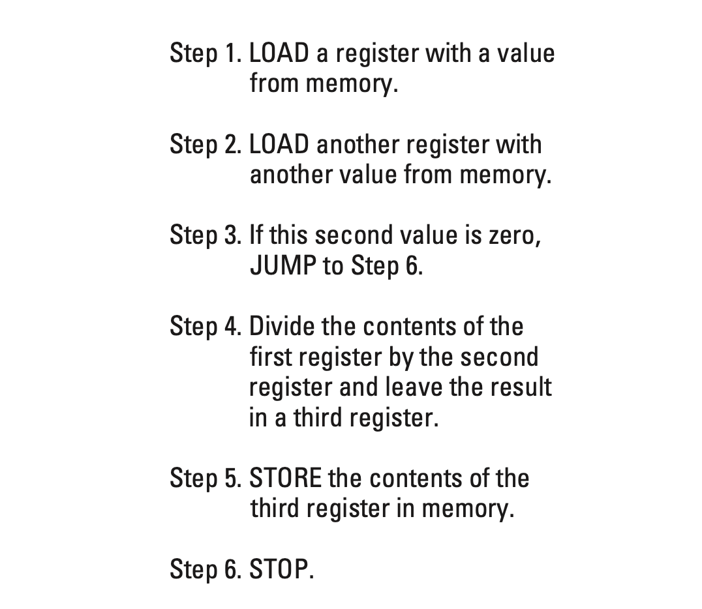

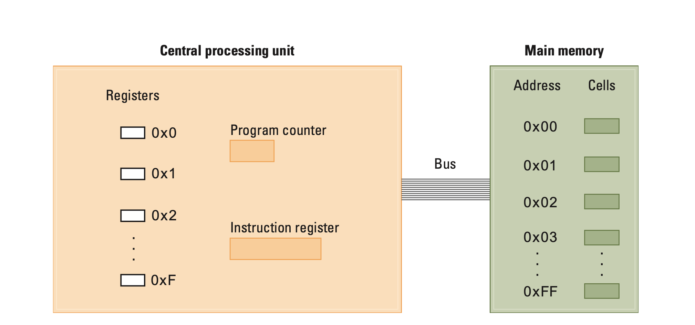

For convenience, we think of these labels and addresses as values represented in base two and compress the resulting bit patterns using hexadecimal notation.

The encoded version of a machine instruction consists of two parts: the **op-code** (short for operation code) field and the **operand** field.

- The bit pattern appearing in the op-code field indicates which of the elementary operations, such as ```STORE```, ```SHIFT```, ```XOR```, and ```JUMP```, is requested by the instruction.
- The bit patterns found in the operand field provide more detailed information about the operation specified by the op-code.

The entire machine language of our Vole machine consists of only twelve basic instructions.

- Each of these instructions is encoded using a total of 16 bits, represented by four hexadecimal digits
- The op-code for each instruction consists of the first 4 bits or, equivalently, the first hexadecimal digit
- The operand field of each instruction on the Vole consists of three hexadecimal digits (12 bits), and in each case (except for the ```HALT``` instruction, which needs no further refinement) clarifies the general instruction given by the op-code.

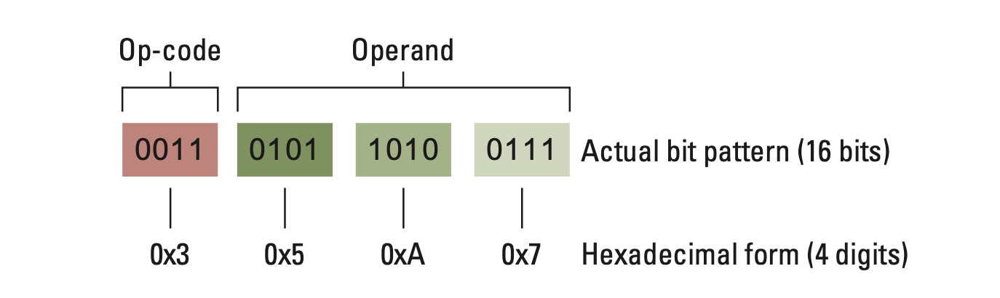

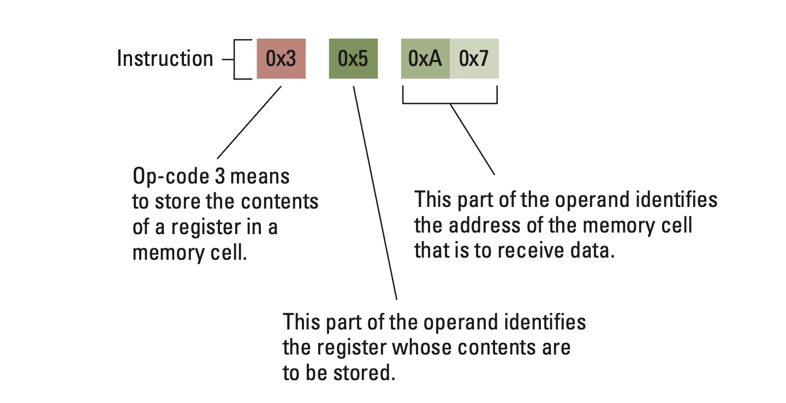

Registers and main memory cells make no distinctions between the types of data they store; how a binary sequence is interpreted depends entirely upon the operations applied to it.

**NOTE** In reality, the instruction 0x35A7 is the bit pattern 0011010110100111.

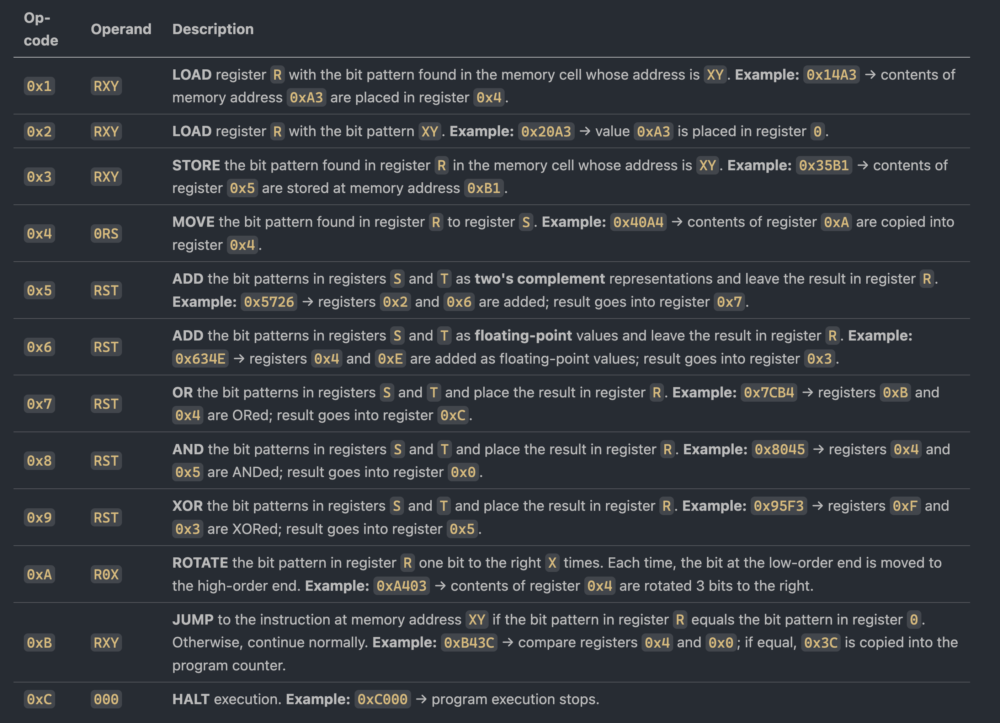

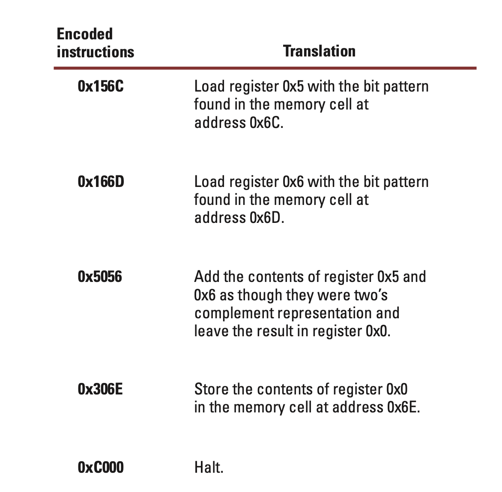

## Program Execution

A computer follows a program stored in its memory by copying the instructions from memory into the CPU as needed.

Once in the CPU, each instruction is decoded and obeyed.

The order in which the instructions are fetched from memory corresponds to the order in which the instructions are stored in memory unless otherwise altered by a ```JUMP``` instruction.

-----

**Two of the special purpose registers within the CPU:**

**the instruction register**: used to hold the instruction being executed

**the program counter**: contains the address of the next instruction to be executed

- thereby serving as the machine’s way of keeping track of where it is in the program

-----

The CPU performs its job by continually repeating an algorithm that guides it through a three-step process known as the **machine cycle**.

The steps in the machine cycle are **fetch**, **decode**, and **execute**

**fetch**

- the CPU requests that main memory provide it with the instruction that is stored at the address indicated by the program counter.
- Since each instruction in our machine is two bytes long, this fetch process involves retrieving the contents of two memory cells from main memory.
- The CPU places the instruction received from memory in its instruction register and then increments the program counter by two so that the counter contains the address of the next instruction stored in memory. Thus, the program counter will be ready for the next fetch.

**decode**

- the instruction is now in the instruction register
- CPU decodes the instruction
    - which involves breaking the operand field into its proper components based on the instruction’s op-code

**execute**

- CPU then executes the instruction by activating the appropriate circuitry to perform the requested task

- For example
    - if the instruction is a load from memory
        - the CPU sends the appropriate signals to main memory
        - waits for main memory to send the data
        - then places the data in the requested register
    - if the instruction is for an arithmetic operation
        -  the CPU activates the appropriate circuitry in the arithmetic/logic unit with the correct registers as inputs
        - waits for the arithmetic/logic unit to compute the answer and place it in the appropriate register.

Once the instruction in the instruction register has been executed, the CPU again begins the machine cycle with the fetch step. Observe that since the program counter was incremented at the end of the previous fetch, it again provides the CPU with the correct address.

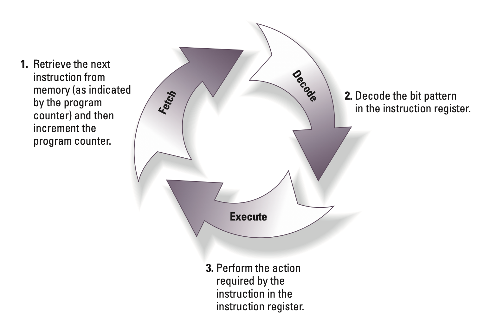

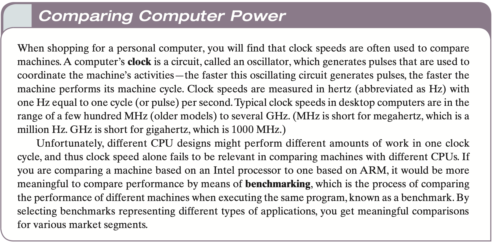

### An Example of Program Execution

Let us follow the machine cycle applied to the program presented above, which retrieves two values from main memory, computes their sum, and stores that total in a main memory cell.

We first need to put the program somewhere in memory - suppose the program is stored in consecutive addresses, starting at address 0xA0.

With the program stored in this manner, we can cause the machine to execute it by placing the address (0xA0) of the first instruction in the program counter and starting the machine

The CPU begins the fetch step of the machine cycle by extracting the instruction stored in main memory at location 0xA0 and placing this instruction (0x156C) in its instruction register

Notice that, in our machine, instructions are 16 bits (two bytes) long. Thus, the entire instruction to be fetched occupies the memory cells at both address 0xA0 and 0xA1

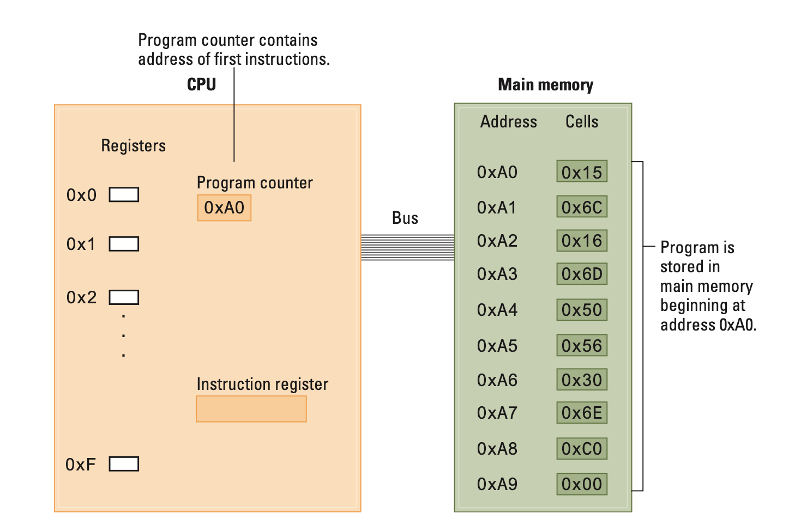

The CPU is designed to take this into account, so it retrieves the contents of both cells and places the bit patterns received in the instruction register, which is 16 bits long.

The CPU then adds two to the program counter so that this register contains the address of the next instruction

At the end of the fetch step of the first machine cycle, the program counter and instruction register contain the following data:

```Program Counter: 0xA2```

```Instruction Register: 0x156C```

Next, the CPU analyzes the instruction in its instruction register and concludes that it is to load register 0x5 with the contents of the memory cell at address 0x6C. This load activity is performed during the execution step of the machine cycle, and the CPU then begins the next cycle.

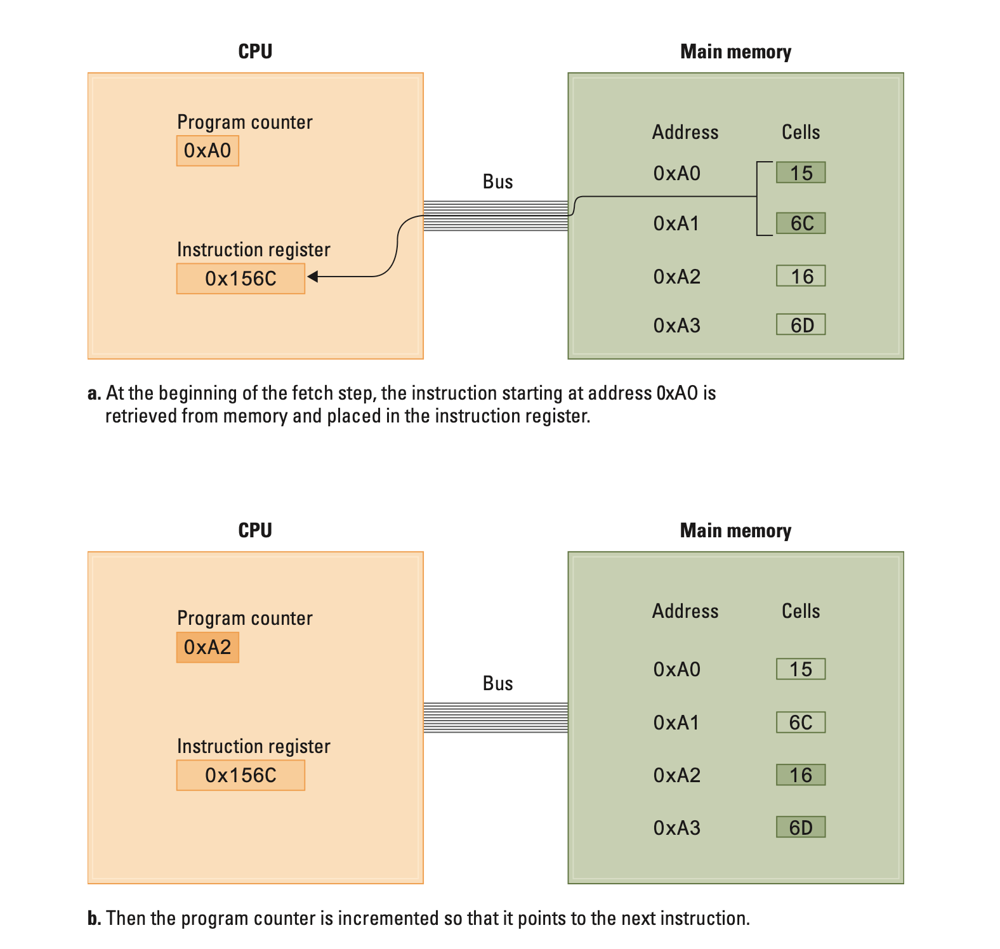

This cycle begins by fetching the instruction 0x166D from the two memory cells starting at address 0xA2. The CPU places this instruction in the instruction register and increments the program counter to 0xA4. The values in the program counter and instruction register therefore become the following:

```Program Counter: 0xA4```

```Instruction Register: 0x166D```

Now the CPU decodes the instruction 0x166D and determines that it is to load register 0x6 with the contents of memory address 0x6D. It then executes the instruction. It is at this time that register 0x6 is actually loaded.

Since the program counter now contains 0xA4, the CPU extracts the next instruction starting at this address.

The result is that 0x5056 is placed in the instruction register, and the program counter is incremented to 0xA6.

The CPU now decodes the contents of its instruction register and executes it by activating the two’s complement addition circuitry with inputs being registers 0x5 and 0x6.

During this execution step, the arithmetic/logic unit performs the requested addition, leaves the result in register 0x0 (as requested by the control unit), and reports to the control unit that it has finished.

The CPU then begins another machine cycle.

Once again, with the aid of the program counter, it fetches the next instruction (0x306E) from the two memory cells starting at memory location 0xA6 and increments the program counter to 0xA8. This instruction is then decoded and executed. At this point, the sum is placed in memory location 0x6E.

The next instruction is fetched starting from memory location 0xA8, and the program counter is incremented to 0xAA. The contents of the instruction register (0xC000) are now decoded as the halt instruction. Consequently, the machine stops during the execute step of the machine cycle, and the program is completed.
